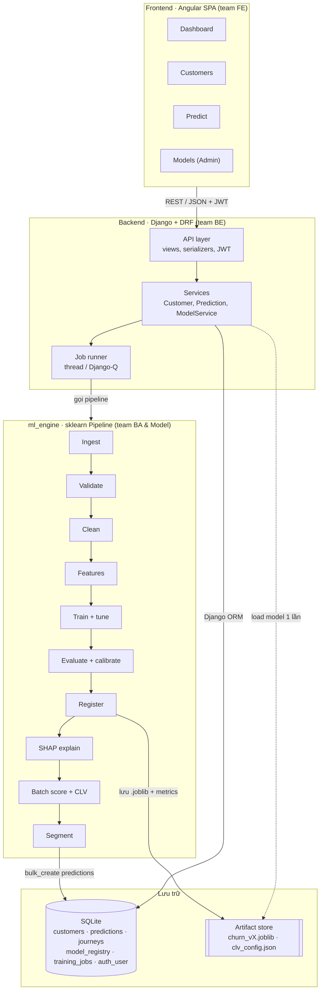
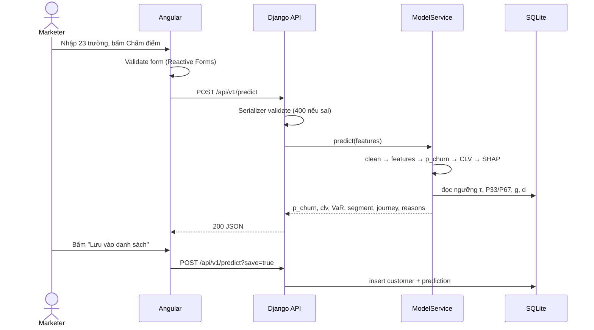
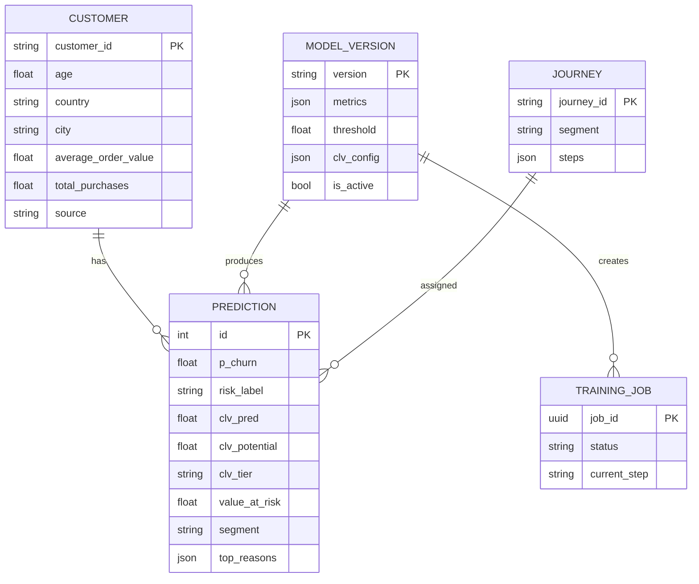

# 03 – Kiến trúc hệ thống và data model

## 1. Tổng quan

Điểm số được chấm sẵn vào SQLite; Angular chỉ đọc qua Django API. Ngoại lệ duy nhất là `/predict`, gọi `ModelService` (model nạp sẵn khi Django khởi động) để chấm khách mới theo thời gian thực.

## 2. Hai luồng chính

**Offline (train + batch).** Admin bấm Retrain → `POST /models/retrain` → Job runner chạy pipeline `ml_engine` → lưu artifact + metrics → Admin activate → batch score ghi 50.000 dòng `predictions`.

**Online (khách mới).** Predict form → `POST /predict` → serializer validate → `ModelService` chạy cùng sklearn Pipeline (clean → features → model churn → công thức CLV → SHAP) → segment + journey → trả JSON; nếu `save=true` thì lưu `customers` + `predictions`.

## 3. Pipeline ML (`ml_engine/src/`)

| Bước | File | Việc làm |
| --- | --- | --- |
| 1. Ingest | `ingest.py` | Đọc CSV, gán `customer_id` (dataset không có ID) |
| 2. Validate | `validate.py` | Schema 25 cột, kiểu, miền giá trị; sai thì dừng và báo lỗi |
| 3. Clean | `clean.py` | `CleanTransformer` theo quy tắc trong [07-data-dictionary.md](07-data-dictionary.md) |
| 4. Features | `features.py` | `engagement_score`, `recency_bucket`, `purchase_per_year`, `service_friction`, `email_responsive`; one-hot Gender/Country/Signup_Quarter; target-encode City |
| 5. Split | `train.py` | 70/15/15 stratify theo Churned, `random_state=42`, cả nhóm dùng chung file split |
| 6. Train + tune | `train.py` | LR, RF, LightGBM/XGBoost; Optuna; `class_weight`/`scale_pos_weight` (so với SMOTE trong báo cáo) |
| 7. Evaluate | `evaluate.py` | ROC-AUC, PR-AUC, Recall, F1, confusion matrix; τ theo F2; calibration isotonic; kiểm tra fairness theo Gender/Country |
| 8. Explain | `explain.py` | SHAP TreeExplainer → top 3 lý do + global importance |
| 9. Register | `train.py` | `churn_vX.joblib`, `clv_config.json` → `artifacts/`; metadata → `model_registry` |
| 10. Score + CLV + segment | `score.py`, `clv.py`, `segment.py` | p_churn, CLV kỳ vọng/tiềm năng, VaR, segment, journey → `predictions` |

**Leakage:** không dùng `Lifetime_Value` làm feature cho model churn.

## 4. Data model (SQLite qua Django ORM)

| Bảng (model) | Khóa | Cột chính | Index / ràng buộc |
| --- | --- | --- | --- |
| `customers` (Customer) | customer_id (PK) | 23 thuộc tính đã làm sạch, source (seed/upload/form), created_at | country |
| `predictions` (Prediction) | id; FK customer + FK model_version (unique together) | p_churn, risk_label, clv_pred (CLV kỳ vọng), clv_potential, clv_tier, value_at_risk, segment, FK journey, top_reasons (JSONField), scored_at | segment, value_at_risk, risk_label |
| `journeys` (Journey) | journey_id | segment, name, steps (JSONField: day, channel, action, offer), kpi | segment unique |
| `model_registry` (ModelVersion) | version | model_type, algo, params (JSON), metrics (JSON), threshold τ, clv_config (JSON: g, d, horizon, P33, P67), artifact_path, is_active, trained_at | model_type + is_active |
| `training_jobs` (TrainingJob) | job_id (UUID) | status, dataset_path, current_step, log, started_at, finished_at | status |
| `auth_user` + Group | id | User có sẵn của Django; Group `Marketer` / `Admin` | username unique |

Ghi chú:

- `db.sqlite3` không commit; `scripts/seed_db.py` dựng lại từ CSV.
- Bật WAL mode (`PRAGMA journal_mode=WAL`) để dashboard đọc được trong lúc batch đang ghi.
- Cần nhiều người ghi đồng thời → đổi sang PostgreSQL bằng `DATABASES`, không sửa model (không dùng `ArrayField` hay JSONB riêng của Postgres).

## 5. Xử lý lỗi và hiệu năng

- **Load model 1 lần** khi Django khởi động (singleton `ModelService`) → `/predict` < 500 ms.
- **Validation 2 lớp:** Angular Reactive Forms + DRF serializer, trả 400 `{field: message}`.
- **Retrain chạy nền** (thread/Django-Q, không cần Celery + Redis). Job lỗi → `failed` + log; version active giữ nguyên.
- **Chặn model kém:** chỉ activate khi metrics không tệ hơn version hiện tại (BR-08) hoặc Admin xác nhận.
- **Quy mô:** 50.000 dòng predictions cỡ vài chục MB; batch score dùng `bulk_create(update_conflicts=True)` lô 1.000 dòng trong một transaction.

## 6. Trade-offs đã chọn

| Quyết định | Chọn | Bỏ qua | Lý do |
| --- | --- | --- | --- |
| Phục vụ ML | Module `ml_engine` import trong Django | Microservice FastAPI | 1 process, team BE 2 người quản lý được; đã module hóa nên tách sau vẫn dễ |
| Scoring | Batch lưu sẵn + realtime cho khách mới | Realtime mọi request | Dashboard đọc nhanh từ DB |
| Hàng đợi retrain | Thread / Django-Q | Celery + Redis | Ít hạ tầng, đủ cho 1 job/lần |
| CLV | Chiết khấu 3 năm + p_churn | BG/NBD + Gamma-Gamma | BG/NBD khớp kém với nhãn churn (AUC 0,61), giữ làm kiểm định chéo |
| Phân khúc | Luật 2 × 3 | Chỉ K-Means | Dễ giải thích cho marketer; K-Means là P1 |
| Model registry | Bảng `model_registry` + file joblib | MLflow | Nhẹ, không thêm server |
| Database | SQLite | PostgreSQL, MySQL | Chạy local, không cần cài server; đổi được qua `DATABASES` |
