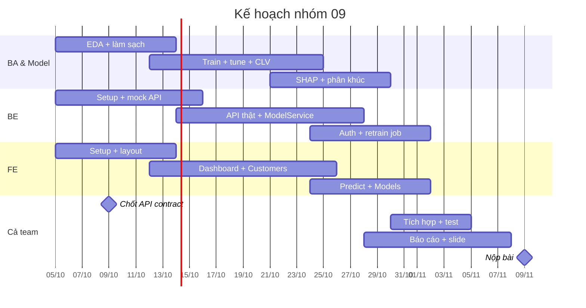

# 08 – Plan và checklist

> 39 task trong 5 tuần, từ 05/10 đến hạn nộp **09/11/2026**. Mỗi task nên được tạo thành một issue trên GitHub Projects (dùng template *Task*). Bản theo dõi trực tiếp nằm ở tab *Checklist* của spec trên Claude; file này là bản tham chiếu trong repo.

## Mốc quan trọng

| Ngày | Mốc |
| --- | --- |
| 09/10 | Chốt API contract ([04-api-contract.md](04-api-contract.md)) |
| 18/10 | `v0.1`: pipeline làm sạch, baseline, mock API, login |
| 25/10 | `v0.2`: model đạt ngưỡng P0, CLV, API khách hàng, màn hình Customers |
| 01/11 | `v0.3`: phân khúc, retrain, Predict, FE chạy trên API thật |
| 08/11 | `v1.0`: bản nộp |
| 09/11 | Gửi thầy link repo + báo cáo + slide |

## Tuần 1 (05–11/10)

| STT | Task | Description | Acceptance | Tiến độ | Main Member | Team | Link | Deadline | Note |
| --- | --- | --- | --- | --- | --- | --- | --- | --- | --- |
| 1 | Chốt spec v1, gửi thầy góp ý về CLV | Hoàn thiện spec 5 tab, gửi mail hỏi 4 giả định CLV | Thầy phản hồi; spec không còn câu hỏi chặn | Đang làm | Khoa | BA & Model |  | 07/10 | Spec tab chính |
| 2 | Tạo repo GitHub monorepo | Cấu trúc thư mục mục 7, branch protection main, GitHub Projects | 6 thành viên clone được; push thẳng main bị chặn | Chưa bắt đầu | Đạt | BE |  | 06/10 |  |
| 3 | Chốt API contract | Viết contract cho các endpoint mục 6.3 kèm JSON mẫu | FE và BE cùng duyệt; có file JSON mẫu cho từng endpoint | Chưa bắt đầu | Huy, Tiến | BE |  | 09/10 | Mốc quan trọng |
| 4 | Notebook EDA | 01_eda.ipynb: phân phối, missing, outlier, tương quan với churn | Bảng lỗi dữ liệu khớp mục 2 tab chính | Chưa bắt đầu | Dương | BA & Model |  | 11/10 |  |
| 5 | Wireframe 6 màn hình | Login, Dashboard, Customers, Customer detail, Predict, Models | Cả nhóm duyệt wireframe | Chưa bắt đầu | Thành | FE |  | 10/10 |  |
| 6 | Setup Angular | Project Angular, routing, layout, Angular Material | ng serve chạy, có menu điều hướng | Chưa bắt đầu | Tiến | FE |  | 11/10 |  |
| 7 | Setup Django | Django + DRF + SQLite + simplejwt, 4 app rỗng | runserver chạy, /admin đăng nhập được | Chưa bắt đầu | Đạt | BE |  | 11/10 |  |

## Tuần 2 (12–18/10)

| STT | Task | Description | Acceptance | Tiến độ | Main Member | Team | Link | Deadline | Note |
| --- | --- | --- | --- | --- | --- | --- | --- | --- | --- |
| 1 | clean.py + features.py | Transformer làm sạch 6 nhóm lỗi và tạo feature mới, có unit test | pytest pass; output không còn NaN, tỷ lệ trong [0, 100] | Chưa bắt đầu | Dương | BA & Model |  | 16/10 | FR-ML-02, 03, 04 |
| 2 | Split cố định + baseline churn | File split 70/15/15 seed 42; so sánh LR, RF, LightGBM | Bảng metrics 3 thuật toán trên validation | Chưa bắt đầu | Khoa | BA & Model |  | 18/10 | FR-ML-05 |
| 3 | Mock API | Trả JSON mẫu cho toàn bộ endpoint đã chốt | FE gọi được mọi endpoint mock | Chưa bắt đầu | Huy | BE |  | 14/10 |  |
| 4 | Django models + migrate | Customer, Prediction, Journey, ModelVersion, TrainingJob | migrate chạy; Django Admin xem được các bảng | Chưa bắt đầu | Đạt | BE |  | 16/10 | Mục 6.2 |
| 5 | Login + phân quyền FE | Trang login, interceptor gắn JWT, route guard theo vai trò | Marketer không vào được /models | Chưa bắt đầu | Tiến | FE |  | 16/10 | FR-AUTH-01, 02, 03 |
| 6 | Dashboard nối mock | Thẻ KPI và ma trận 2×3 | Tổng 6 ô bằng tổng số khách | Chưa bắt đầu | Thành | FE |  | 18/10 | FR-DASH-01, 02 |
| 7 | Tag v0.1 | Merge develop vào main, tag v0.1 | Tag v0.1 trên GitHub | Chưa bắt đầu | Khoa | Cả team |  | 18/10 |  |

## Tuần 3 (19–25/10)

| STT | Task | Description | Acceptance | Tiến độ | Main Member | Team | Link | Deadline | Note |
| --- | --- | --- | --- | --- | --- | --- | --- | --- | --- |
| 1 | Tune + calibration model churn | Optuna, 5-fold CV, hiệu chỉnh isotonic, chọn τ theo F2 | AUC ≥ 0,90 và Recall ≥ 0,80 trên test | Chưa bắt đầu | Khoa | BA & Model |  | 23/10 | FR-ML-05, 06 |
| 2 | clv.py | CLV tiềm năng và kỳ vọng theo công thức 3 năm, phân tích độ nhạy d | Spearman với Lifetime_Value ≥ 0,5; không giá trị âm/NaN | Chưa bắt đầu | Dương | BA & Model |  | 23/10 | Mục 6.5 |
| 3 | SHAP explain | Global importance + top 3 lý do cho từng khách | Mỗi khách có 3 lý do kèm giá trị | Chưa bắt đầu | Dương | BA & Model |  | 25/10 | FR-ML-07 |
| 4 | API khách hàng thật | List, filter, search, sort, detail, export CSV | Kết quả filter khớp truy vấn DB | Chưa bắt đầu | Huy | BE |  | 25/10 | FR-CUS-01 đến 07 |
| 5 | ModelService + /predict | Load model 1 lần, serializer validate 23 trường | Phản hồi < 500 ms; Age = 200 trả 400 | Chưa bắt đầu | Đạt | BE |  | 25/10 | FR-PRED-01, 02, 03 |
| 6 | Màn hình Customers + detail | Bảng phân trang, bộ lọc, hồ sơ khách, 3 lý do | Story CRM Executive chạy trên mock | Chưa bắt đầu | Thành | FE |  | 25/10 | FR-CUS |
| 7 | Biểu đồ dashboard | Histogram p_churn, cột theo quốc gia, click ô ma trận sang danh sách | Click ô S1 mở danh sách đã lọc | Chưa bắt đầu | Tiến | FE |  | 25/10 | FR-DASH-03, 04 |
| 8 | Tag v0.2 | Merge và tag | Tag v0.2 trên GitHub | Chưa bắt đầu | Khoa | Cả team |  | 25/10 |  |

## Tuần 4 (26/10–01/11)

| STT | Task | Description | Acceptance | Tiến độ | Main Member | Team | Link | Deadline | Note |
| --- | --- | --- | --- | --- | --- | --- | --- | --- | --- |
| 1 | segment.py + 6 journey + seed_db.py | Phân khúc theo BR-04, nạp 6 journey, script seed một lệnh | Chạy seed trên máy mới là dashboard có đủ 50.000 khách | Chưa bắt đầu | Khoa | BA & Model |  | 29/10 | FR-SEG-01, 02; FR-ML-10 |
| 2 | Register + batch score | Lưu joblib, clv_config, ghi model_registry; bulk_create 1.000 dòng/lô | 50.000 khách chấm < 2 phút | Chưa bắt đầu | Dương | BA & Model |  | 29/10 | FR-ML-08, 09 |
| 3 | Retrain job + activate | Job runner, trạng thái job, activate version, chặn 2 job cùng lúc | Retrain lần 2 khi đang chạy trả 409 | Chưa bắt đầu | Đạt | BE |  | 01/11 | FR-MDL-01, 03, 04, 06 |
| 4 | API journeys + ngưỡng | GET journeys; PATCH ngưỡng chỉ cho Admin | Marketer gọi PATCH ngưỡng nhận 403 | Chưa bắt đầu | Huy | BE |  | 30/10 | FR-SEG-03 |
| 5 | Màn hình Predict | Form 23 trường theo bảng validate, City phụ thuộc Country | Nhập sai bị chặn tại ô; kết quả hiển thị segment và journey | Chưa bắt đầu | Tiến | FE |  | 30/10 | FR-PRED |
| 6 | Màn hình Models + Journeys | Danh sách version, nút retrain, theo dõi job; trang 6 journey | Admin retrain và activate được trên giao diện | Chưa bắt đầu | Thành | FE |  | 01/11 | FR-MDL, FR-SEG |
| 7 | Chuyển FE sang API thật | Bỏ mock, nối toàn bộ màn hình với BE | Không còn gọi mock trong code | Chưa bắt đầu | Tiến, Thành | FE |  | 01/11 |  |
| 8 | Báo cáo: phương pháp CLV + lộ trình | Viết chương phương pháp và chương đề xuất marketing | Trích dẫn đã kiểm tra bản gốc qua thư viện | Chưa bắt đầu | Khoa | BA & Model |  | 01/11 | Tab Nghiên cứu CLV, Lộ trình |
| 9 | Tag v0.3 | Merge và tag | Tag v0.3 trên GitHub | Chưa bắt đầu | Khoa | Cả team |  | 01/11 |  |

## Tuần 5 (02–08/11) và ngày nộp

| STT | Task | Description | Acceptance | Tiến độ | Main Member | Team | Link | Deadline | Note |
| --- | --- | --- | --- | --- | --- | --- | --- | --- | --- |
| 1 | Test tích hợp end-to-end | Chạy toàn bộ acceptance criteria trong tab Functional Requirements | Toàn bộ FR P0 pass | Chưa bắt đầu | Cả nhóm | Cả team |  | 05/11 | 43 FR |
| 2 | Fix bug | Sửa lỗi phát hiện khi test tích hợp | Không còn lỗi chặn demo | Chưa bắt đầu | Cả nhóm | Cả team |  | 06/11 |  |
| 3 | Clone test trên máy mới | Một bạn ngoài team BE clone repo về máy Windows và làm theo README | Chạy được trong dưới 15 phút, không cần hỏi | Chưa bắt đầu | Thành | FE |  | 05/11 | Bàn giao repo |
| 4 | README + .env.example | 4 bước chạy, tài khoản demo, ảnh chụp, sơ đồ kiến trúc | Clone test pass | Chưa bắt đầu | Đạt | BE |  | 06/11 |  |
| 5 | Báo cáo + slide | Hoàn thiện báo cáo và slide thuyết trình | Cả nhóm đọc duyệt | Chưa bắt đầu | Khoa, Dương | BA & Model |  | 08/11 |  |
| 6 | Video demo dự phòng | Quay demo các luồng chính | Video dưới 5 phút, link trong README | Chưa bắt đầu | Tiến | FE |  | 07/11 |  |
| 7 | Tag v1.0 | Merge và tag bản nộp | Tag v1.0 trên GitHub | Chưa bắt đầu | Khoa | Cả team |  | 08/11 |  |
| 8 | Nộp bài | Gửi thầy link repo (tag v1.0), báo cáo và slide | Thầy xác nhận đã nhận | Chưa bắt đầu | Khoa | Cả team |  | 09/11 | Hạn chót |
